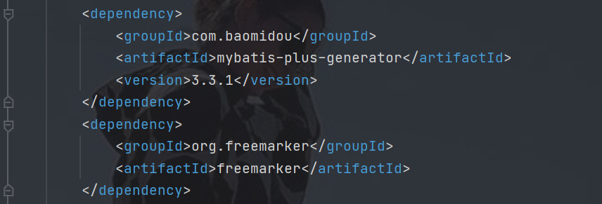

SpringCloud-alibaba 集成seata分布式事务管理
=================

## 后端技术架构
- 基础架构：SpringBoot 2.2.11.RELEASE
- SpringCloud版本：Hoxton.SR9
- spring-cloud-alibaba：2.2.1.RELEASE
- 持久层框架：Mybatis-Plus_3.3.1
- Mysql数据库版本：8.0
- lombok版本：1.18.16
- seata版本：1.3.0

## 开发环境
- 语言：Java 8

- IDE(JAVA)： Eclipse安装lombok插件 或者 IDEA

- 依赖管理：Maven

##需要搭建nacos以及seata

在mysql数据库中依次执行db文件夹下面的sql文件

##里面的MysqlGenerator.java文件是个反向工程代码生成文件，需要依赖以下jar包

    <dependency>
        <groupId>com.baomidou</groupId>
        <artifactId>mybatis-plus-generator</artifactId>
        <version>3.3.1</version>
    </dependency>
    <dependency>
        <groupId>org.freemarker</groupId>
        <artifactId>freemarker</artifactId>
    </dependency>
